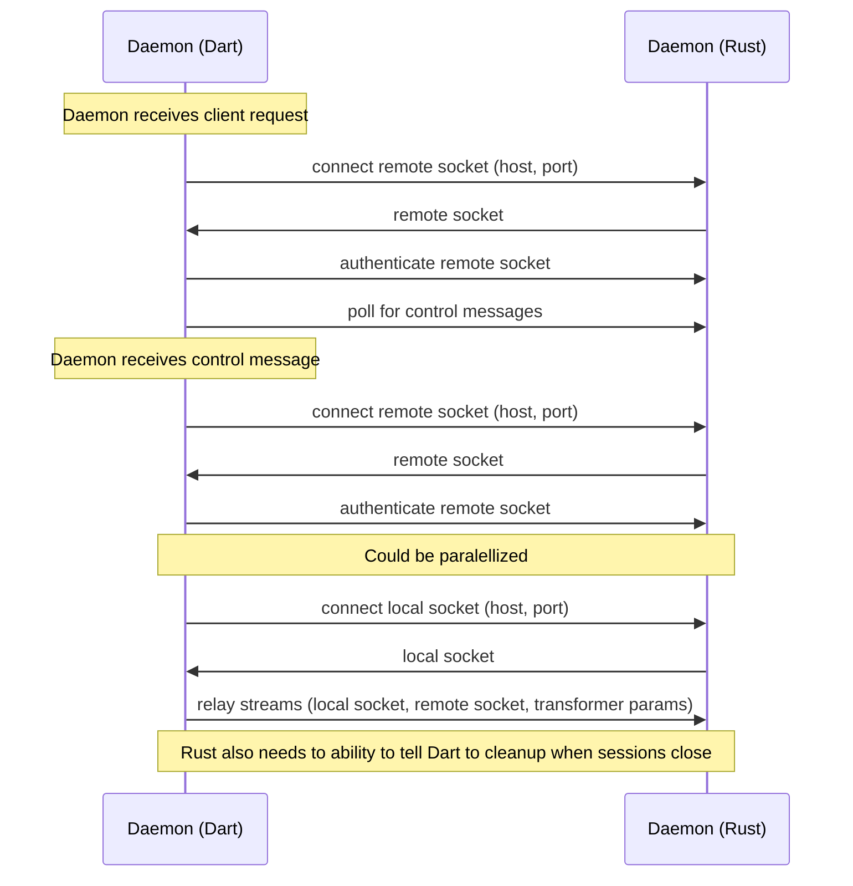
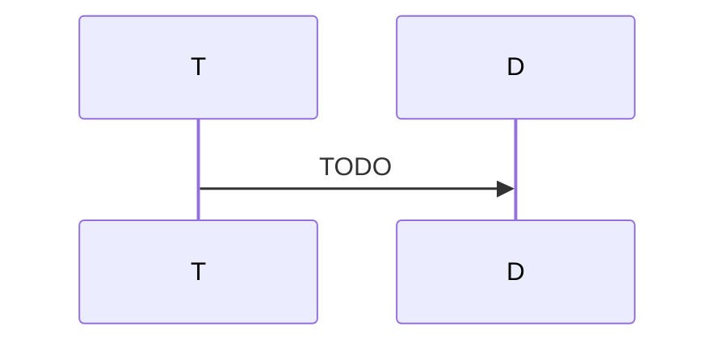

# Sequence Diagrams

## Daemon Sequence


```mermaid
sequenceDiagram
  participant D as Daemon (Dart)
  participant R as Daemon (Rust)

  Note over D: Daemon receives client request

  D ->> R: connect remote socket (host, port)
  R ->> D: remote socket
  D ->> R: authenticate remote socket
  D ->> R: poll for control messages
  
Note over D: Daemon receives control message
  D ->> R: connect remote socket (host, port)
  R ->> D: remote socket
  D ->> R: authenticate remote socket

Note over D,R: Could be paralellized
  D ->> R: connect local socket (host, port)
  R ->> D: local socket

  D ->> R: relay streams (local socket, remote socket, transformer params)
Note over D,R: Rust also needs to ability to tell Dart to cleanup when sessions close
```

## Cli Client Sequence


```mermaid
sequenceDiagram
  T ->> D: TODO
```

## Flutter Client Sequence

```
sequenceDiagram
  T ->> D: TODO
```
